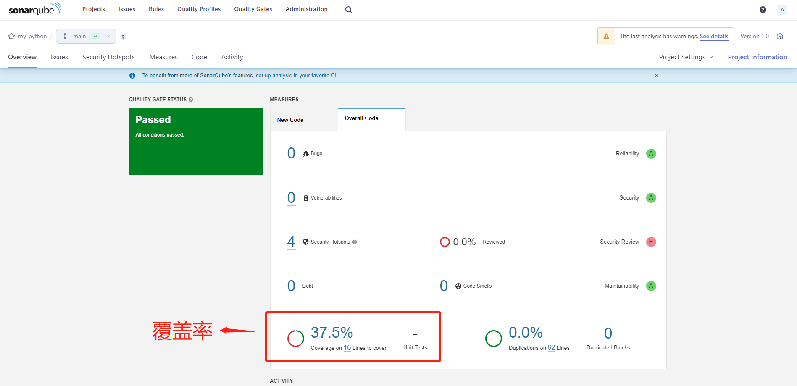

#### clone code

```
git clone https://github.com/huyushi/python-sonarqube.git
cd python-sonarqube
```


#### run SonarQube

```
docker-compose up
```


#### build app

```
docker build -t my-app:v1.0 .
```




#### run app

```
docker run -d -p 5000:5000 --name my_app my-app:v1.0
curl http://127.0.0.1:5000
```


